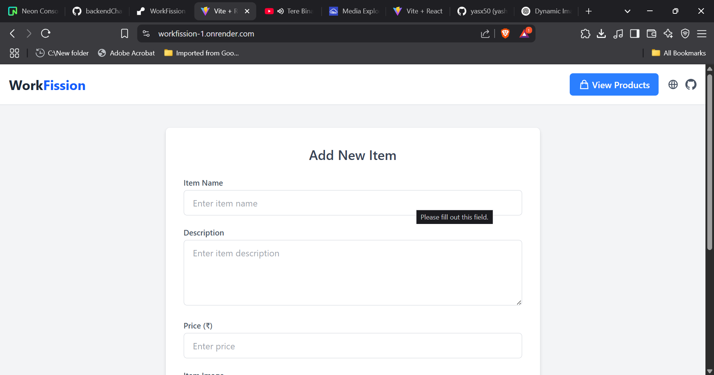
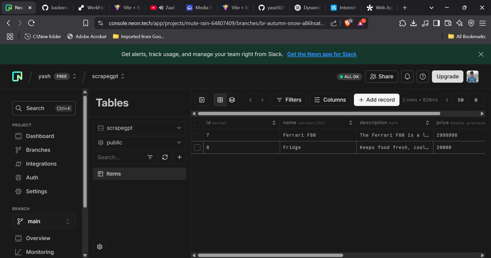
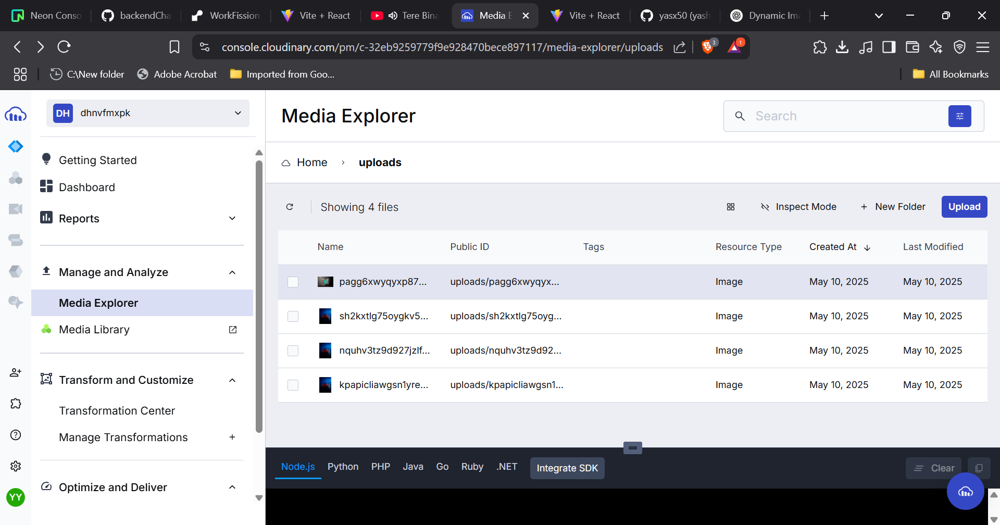

# WorkFission

### Mini E-Commerce Platform with Two Tabs
### Add items page (Tab 1)

### Show items page (Tab 2)

### DataBase Entries (PostgreSQL)

### Cloudinary


## 🧰 Tech Stack

### Frontend
- ⚡ Vite
- ⚛️ React
- 💨 Tailwind CSS

### Backend
- 🧠 Express.js
- 🗃️ PostgreSQL
- ☁️ Cloudinary

---
### first clone the project
```
git clone https://github.com/yasx50/WorkFission.git
```

### setup for frontend
```
cd WorkFission
npm install
npm run dev
```
### setup for backend
```
cd backend
npm install
node app.js
```


